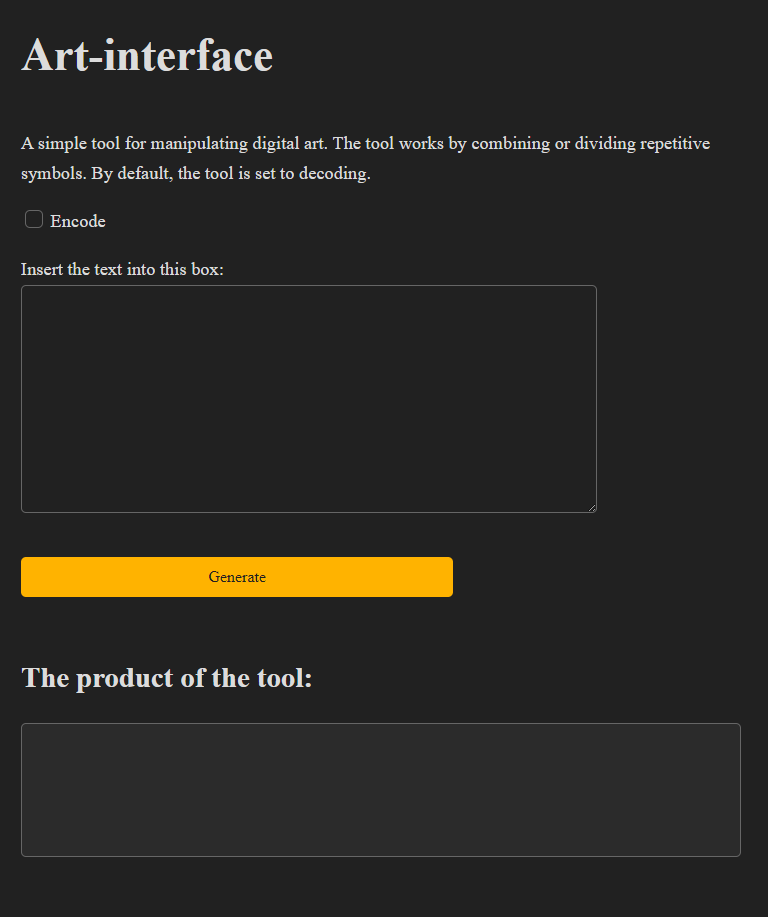

## Art-Interface

The **Art-Decoder** is in the coder folder.

The program consists of a **main()** file that creates a server, a **design.html** file that controls the values, inputs and outputs of the web tool, a **style.css**(got inspiration from: https://github.com/kevquirk/simple.css/tree/main) file that controls the visible elements, styles and fonts. 

This web tool relies on a server that can communicate with the command line interface using the **exec.Command()** command, which feeds the input into the encoder/decoder tool. *There is no need for a separate multiline check because the server immediately converts the input into a string and it does not matter what kind of symbols are present in the string.*

### Usage

When the server is running on your computer, the website can be accessed through a browser by entering http://localhost:4444 into the search bar. The tool has a title and small description, it is by default set to decoding art. There is a single check which switches the tool into an encoder. Then there is a textbox into which the art can be written. The *Generate* button is underneath the box and the output of the tool is shown in the bottom box.

This is how the web tool looks like:

Here is an example of the product of the encoder:

Here is an example of the product of the decoder:

