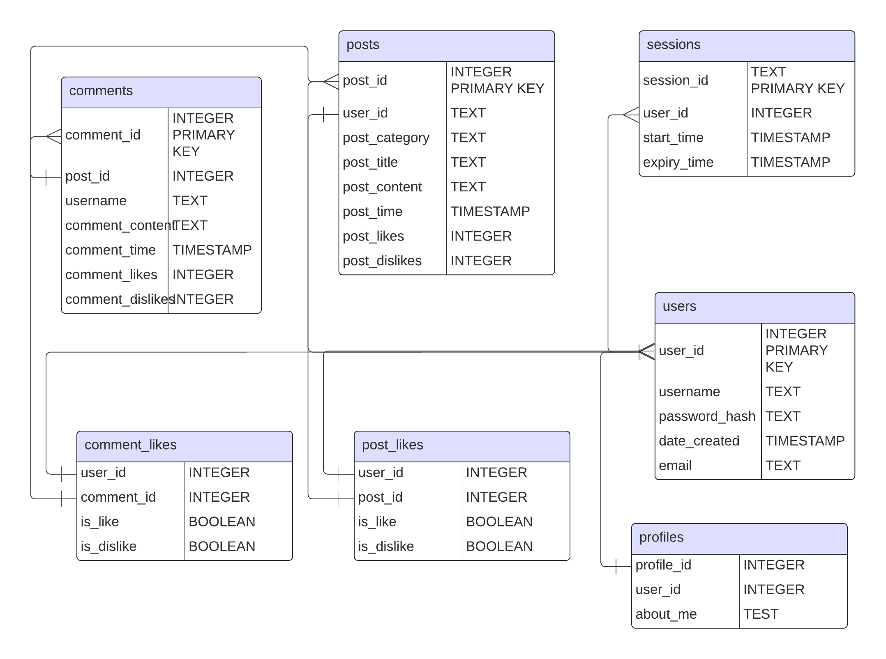

##  **The Literary-Lions Forum**

### Setup

Clone the repository without version control metadata:

```text
git clone https://gitea.kood.tech/markokarilaid/literary-lions.git && rm -rf /.git
```

Once the files are in the directory, you can start the website with the command `go run .` The website will be accessible through *http://localhost:5555*. 

#### Docker:
You can alternatively run the program with Docker. First build the Docker image:
```text
docker build -t your_image_name .
```
Then run a container based on this image:
```text
docker run -p 9090:5555 your_image_name
```

This command will expose port 5555 of the container to port 9090 on your host machine for accessing the web server at *http://localhost:9090*. 
*NOTE:* this method can take a few minutes for the site to be fully up.


### Usage

The home page consists of two parts: user login/registration and a table of posts. A user can either register their account, and then a window will pop up, allowing them to do so, or they can log in by using the two fields provided on the screen. In the posts section, the user can also choose either to navigate to the profile page of the post author or to the post page itself to see the contents of the post.

*NOTE:* the code has built the database, but you'll have to create the users/post/comments!

The second page that the forum has is the post page, which contains all the information about the post and also all the comments and reactions thereof. Commenting, liking, and disliking are user-based.

The third page is the user profile page, where all the information about a user is displayed and where a user can write their little bio and display it to those who click on their user page.

### Mechanism

The forum runs on three layers- The first layer is the main server that generates HTML templates and handles the basic mechanisms of the webpage. The second layer is the API that queries the database for the information that is requested and is meant to directly handle SQL queries. The third layer is the database layer, which generates an interconnected database for the API to pull and store information from and to.

#### Database

The structure of the database is visualised here:

