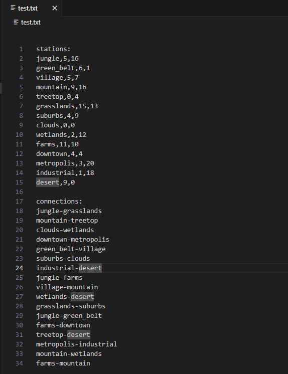
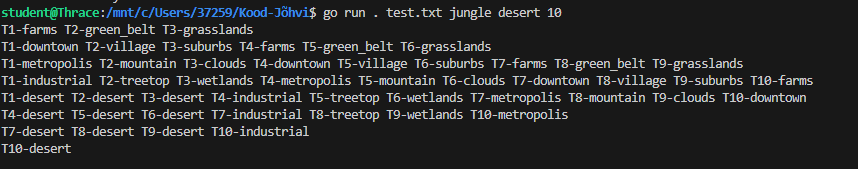

# Stations-Pathfinder

This algorithm takes in four arguments and produces the most efficient path for trains to move so that no trains are in the same station at the same time. The algorithm uses turns to allow trains to move in a user-provided railway map. In the output, every line is a turn and trains are designated with the letter **T** and the number of the train. 

The program takes in the name of the railway map file, the name of the beginning station, the name of the ending station and the number of trains that need to be routed through the map.

## Logic

The program uses two algorithms to plan the rail traffic. The first algorithm is a Dijkstra algorithm that generates valid paths through the distance of the paths from the start. There is also an A* distance-based algorithm but it is not suggested to be taken too seriously because it heavily favours the distance between stations themselves and does not take into account the number of stations. For the review use cases, there was no use for hard distance-based algorithmic logic.

The dispatch algorithm functions through two functions, the first function assigns valid paths to every train, from most efficient to least and inputs that data into a printing function that prints out every active station that a train is at at every given time. The printing function used two loops, one to change station names to their neighbour names and another to print visible station names.

### Testing

There is also a test suite program that covers all of the different railway maps and their criteria. If you write **go test** into the terminal, it runns all tests in the testing file.

## Usage

This is how the text file should look like in the working directory:

Based on the example file this is how the input should look like, the first elements are the command for the go function to run, then the name of the text file in the working directory, the name of the beginning station, the name of the end station and lastly the number of trains that should be dispatched through the map:

What is also shown on this image is the expected output of the command based on the example text file.